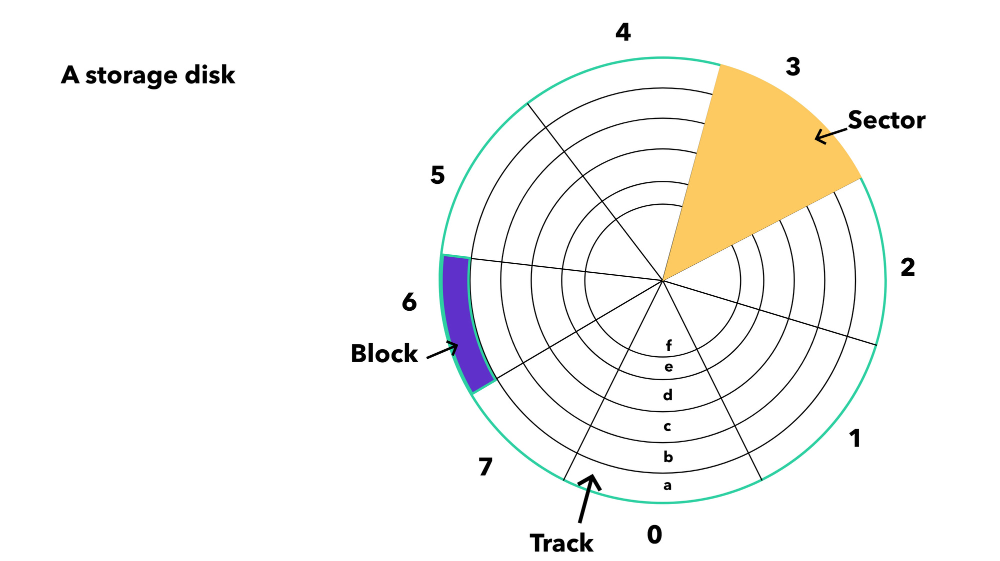

# B and B+ tree

## Disk Structure



## How data is stored on disk

Data in a database is stored in fixed-size disk pages, where each page contains multiple rows and a slot directory, 
and indexes map keys to (page, offset) locations for fast retrieval.

## What is Indexing

An index in a database is a separate data structure that helps you find row faster - just like an index in a book.

```java
// Index entry looks like
(key, pointer)
```

Pointer depends on DB implementation. Most common is logical pointer, which points to

- Page number (disk block)
- Offset inside page

```sql
id | name
1  | Ram
2  | Shyam
3  | Mohan

Index : 
1 → (page 5, offset 2)
2 → (page 6, offset 1)
3 → (page 8, offset 4)
```

## What is Multilevel Indexing

Multilevel indexing is a technique where indexes are built on top of other indexes to reduce search time and disk I/O, 
typically implemented using tree structures like B+ trees.

```shell
Level 1 (primary index):
10 → page 5  
20 → page 9  
30 → page 13  
...

Level 2 index:
10 → points to part of level 1  
30 → points to part of level 1  
50 → ...

Final Structure:

Level 2 (small index)
   ↓
Level 1 (bigger index)
   ↓
Actual data (pages)
```

## M way search 
## B trees
## Insertion and Deletion of B trees
## B+ trees
