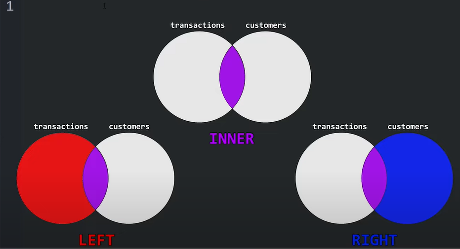

# Introduction to SQL

## Select

- Select is not dependent on table.

Avoid null in DB as it can lead to wierd behaviors.

```sql
SELECT 
    10 + 5 AS Addition, 
    10 - 5 AS Subtraction, 
    10 * 5 AS Multiplication, 
    10 / 5 AS Division, 
    10 % 3 AS Modulus,
    10 + null AS sample;

addition subtraction multiplication division modulus   sample
    15      5               50          2       1       null
```

## Comments

```sql
-- single line comment

/*
Multi
line
comment
*/
```

## Having clause

SQL applies predicates in the having clause after groups have been formed, so aggregate functions may be used in
the having clause.

```sql
--instead of having we cant use where, as it will give syntax error

select dept_name, avg (salary) as avg_salary
from instructor
group by dept_name
having avg(salary) > 42000;

/*
OP:
"dept_name"     "avg_salary"
"Finance"     85000.000000000000
"History"     61000.000000000000
"Physics"     91000.000000000000
"Comp. Sci." 77333.333333333333
"Biology"     72000.000000000000
"Elec. Eng." 80000.000000000000
*/
```

## Logical Precedence of Clauses in SQL

 1. FROM
 • Tables and joins are resolved to generate the initial data set.

 2. WHERE
 • Filters rows from the data set before grouping or aggregation.

 3. GROUP BY
 • Groups the filtered rows into buckets based on the specified column(s).

 4. Aggregate Functions
 • Aggregate operations (e.g., SUM, AVG) are applied to each group created by the GROUP BY.

 5. HAVING
 • Filters the groups based on conditions applied to aggregate functions or group-level data.

 6. SELECT
 • Evaluates and retrieves the specified columns or expressions, including aggregated results.

 7. ORDER BY (if present)
 • Sorts the final result set.

## JOIN



## Nested Subqueries
