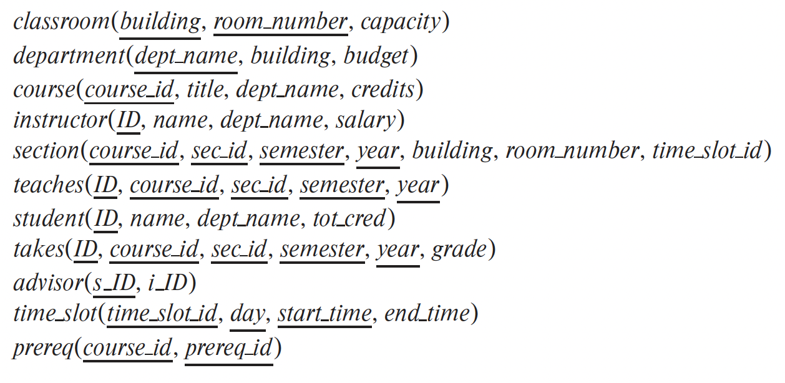
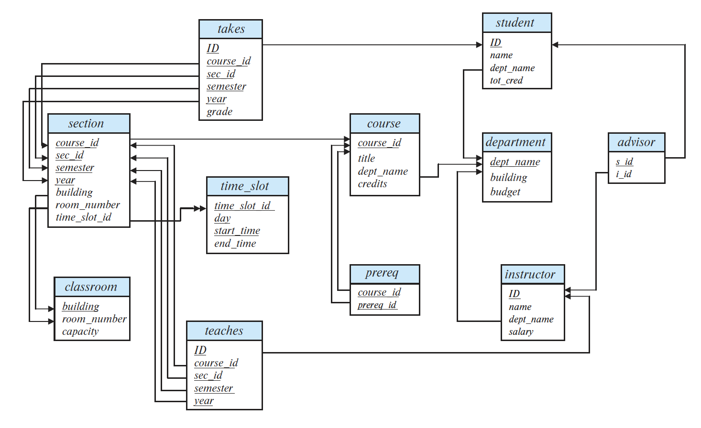

# Introduction to Relational model

- Relation : Table
- Tuple : Row
- Attribute : Column
- Domain : Set of permitted values of a given attribute
- Database schema : Logical design of the database
- Database instance : Snapshot of the data in the database at a given instant in time

## Null value

The null values is a special value that signifies that the value is unknown or does not exist. Null values cause a
number of difficulties when we access or update the database, and thus they should be eliminated if at all possible.

## Keys

A key in a database is a field(or a set of fields) that uniquely identified a tuple within a table.

- Super key :  Any set of fields that uniquely identify a row in a table. This includes the primary key and any
               superset of the primary key.
- Candiate key : A field or combination of fields that could serve as a primary key.
- Primary key : A field or combination of fields that uniquely identifies each record in a table. It cannot contain NULL
                values. Each table can have only 1 primary key. These are underlined.

## Relational Algebra

The relational algebra consists of a set of operations that takes one or two relations as input and produce a new
relation as their output.

- Select operation

The select operation selects tuples that satisy a given predicate.

Select tuples of the instructor relation where instructor is in Physics department.
    σ dept_name =“Physics” (instructor)

- Project operation

Selects specific columns or attributes.

    πid,name,salary(instructor)

### Compostion of relational operations

Find the names of all instructors in the Physics department

π name (σ dept_name =“Physics” (instructor))

### Cartesian product operation

We write the Cartesian product of relations r1 and r2 as r1 × r2.

### Join operation

Relations r(R) and s(S), and let θ be a predicate on attributes in the schema R ∪ S.
The join operation r ⋈θ s is defined as follows:
    r ⋈θ s = σθ(r × s)

### Set operations

- intersection : The intersection operation, denoted by ∩, allows us to find tuples that are in both the input relations
- set difference : The set-difference operation, denoted by −, allows us to find tuples that are in one
                    relation but are not in another
- assignment : denoted by ←

### Rename operation

Rename as x

ρx(A1,A2,…,An) (E)
